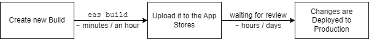
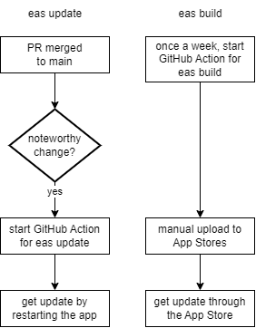

# Continuous Deployment
> **Abstract**: *This document outlines the possibilities we have with Expo to deploy changes and the process we want / should use for our app.*

**Table of contents**  
| ---- [Deployment Mechanisms with Expo](#deployment-mechanisms-with-expo)  
| -------- [1. Creating a New Build](#1-creating-a-new-build)  
| -------- [2. Over-the-Air Updates (OAT)](#2-over-the-air-updates-oat)  
| ---- [Our Process for Continuous Deployment](#our-process-for-continuous-deployment)  

Getting changes into production fast and often is an important part of software development. This ensures that users always get the newest features and bug fixes and simplifies the process for developers as well, avoiding large releases with more potential breaking changes.

## Deployment Mechanisms with Expo
There are basically two options for us to deploy changes to production, builds and updates.

### 1. Creating a New Build
First of all, we can create a completely new build, upload it to the Google Play Store for Android and App Store for iOS. Google / Apple will have to review those changes before they'll be published. The complete process can take between several hours up to a few days, so it's relatively slow.

  

Once the changes are deployed to production, a user goes to the app store and updates his app to get the newest features. It's also worth mentioning that we have only 30 builds per month through Expo's build service.

### 2. Over-the-Air Updates (OAT)
On app start, Expo looks if there are new updates available and downloads them if that's the case. For the update to become effective, the app has to be restarted. It is important to understand here, that restarting the app means closing it completely, not just putting it into the background. While it is a faster alternative to time consuming builds, it can be difficult to comprehend and users might not restart the app on a regular basis.

To make it fit our needs, we can customize this default behavior from Expo. For example, we could look for updates every time the app is put into the foreground and display a popup to download it and restart the app. While this concrete example offers a better user experience in theory, it could be possible for us to make new deliveries multiple times a day. This would make the popup appear constantly, to a point where it disturbs and annoys the user.

## Our Process for Continuous Deployment
To ensure fast updates, we'll use *eas update* for all of our noteworthy changes. We have a GitHub Action in place that can be used for every change we want to put into production instantely. Whether users will receive those updates because they restart the app or not is something we need to keep track of in the future. For members of our team, there's also the button in the Dev Screen to force an update.

Users that download the app from the app store shouldn't be too far behind the updates. We'll setup a GitHub Action that runs once a week to create a build, that we can manually upload to the app stores, depending on the amount of changes there were in that week. In that manner, we'll use about eight builds of the 30 build contingent, which leaves us with enough free builds in case we want to test something in between, or if there's a critical build we need to make.

This process leaves us with a few manual steps, like starting the GitHub Action for *eas update* and uploading new builds to the app stores. Even though these steps could be automated, I don't think it's worth the effort.

  

*\*Note: Right now we have a develop and production branch. In the future, I would adapt to a single `main` branch, that always has the up-to-date production ready state of the app.*

## Next Actions
Now:
- Remove production branch and rename develop branch to 'main'  
(Ensure that the eas update still works with the new branch)
- Setup the GitHub Action that triggers a build once a week
- For now, I would say we adapt the GitHub Action for eas update to increase the version number by one patch version (+0.0.1)

Future:
- Think about tracking the app version of users (similar to the X-Session-Id, we could have the version number in the header of our requests to the backend)
- Think about improving the update experience for users, with a popup that could store the time it last showed in AsyncStorage. Then we could show this popup to the user max once a day / once a week
