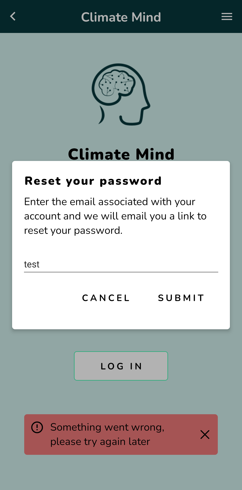
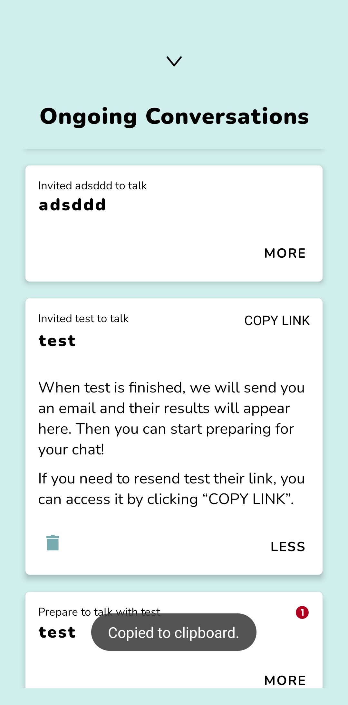

# Toast Messages

I think it will be useful for the future to have a reference why we don't use a library for toast messages and how our own solution is implemented.

At the start we used the library `react-native-root-toast` to handle toast messages and it worked great for our purposes. However, we started to notice some flaws with this approach. Below you can see two images that show them. On the left side, the toast message is behind the backdrop of the modal and on the right side, the toast message again is behind the drawer modal and therefore not visible at all.

<div style="display: flex; justify-content: space-around;">
  
  
</div>

<br />

The reason seems to have something to do with how React Native is rendering all it's components inside a root view. Modals are rendered on top of that root view, so it isn't possible that anything within the root view will be above a modal.

<br />

It could be possible to find a solution with the `react-native-root-toast` package or move to another libary that can handle it out of the box, but it seemed easier to go with a custom made solution. This would also make it easier to customize things to our likings.

This custom implementation consists of a `CmToast` component, which can be set visible through a redux reducer. The CmToast component has a timeout where it sets itself invisible again. It is being rendered in two places. First, in the *App.tsx*, so that it will be visible in normal circumstances.

```typescript
<Provider store={store}>
  <SafeAreaView style={styles.safeArea}>
    <StatusBar style="light" backgroundColor={Colors.themeDark} />
    <NavigationContainer>
      <NavigationRoot canGoBack={canGoBack} />
    </NavigationContainer>

    // Render CmToast beside the main application (NavigationRoot)
    <CmToast />
  </SafeAreaView>
</Provider>
```

<br />

Second, to also be visible when modals / drawers are opened, we have a custom `CmModal` component, which basically is just a wrapper for React Native's Modal, but includes the CmToast.

```typescript
function CmModal({ children, ...rest }: Props) {
  return (
    <Modal {...rest}>
      {children}

      // Render CmToast inside each modal to make sure it is always visible
      <CmToast />
    </Modal>
  );
}
```

<br />

Now we only need to replace out every occurence of `<Modal>` with `<CmModal>` and we're good to go.

<br />

Finally, when we have some time, there's one possible improvement. Currently, it isn't possible to show more than one toast message at once, they would just overlap. React Material UI shows a behavior that would be better [here](https://mui.com/material-ui/react-snackbar/#notistack). Each toast message would just pop up above the last one, making it possible to have several toast messages visible at once. To implement it, we could just create another component like a `Toastqueue`, that we render in the two places where the CmToast is rendered currently. Then, the redux reducer would just add a toast with its type and message to an array. The Toastqueue will render one CmToast for every toast message in the array. Toasts remove themselves after a timeout automatically from that array.
