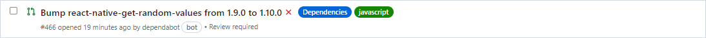
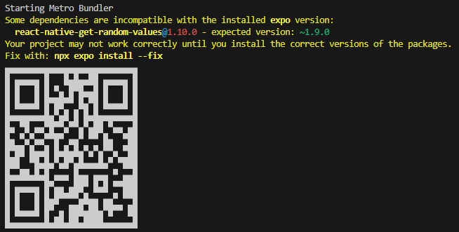
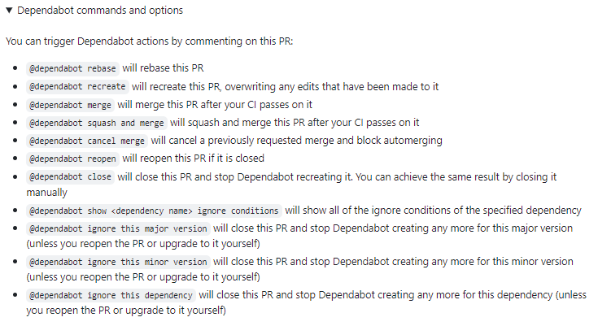

# How we are keeping dependencies up-to-date
Having up-to-date dependencies is important for a long term successful project. Getting new features, security, performance, stability updates, etc.

To ensure we don't end up with lots of old dependencies, we use GitHubs dependabot. It will automatically create PRs when new versions of packages we use come up. Here's the process how to decide if you should update the dependency or not.

If you are not familiar with semantic versioning, you can read more about it here [https://semver.org/](https://semver.org/).  
What you only really need to know: \<major>.\<minor>.\<patch>, eg. 2.5.23.

## 1. You see a new PR opened
In this example, we can see that dependabot wants to upgrade the `react-native-get-random-values` library from 1.9.0 to 1.10.0.

Updates for *minor* and *patch* versions are usually no big deal. If you open the PR, you can also read about the release notes to check if any breaking changes have been introduced. At the moment of this writing, there's also a PR for an update to the `expo` library from 49.0.21 to 50.0.1, which can be a bit more challenging, because it's likely that there are some code changes necessary that dependabot isn't aware of.

## 2. Check for expos compatibility
Go to your local development environment and install the dependency, in this example I would just do `npm install react-native-get-random-values@latest`. Then you do an `npm start`. If the package is incompatible with the current expo version, you see a warning message above the QR code. This means that we cannot update to the version and we will ignore the PR from dependabot (see [section 4](#4-ignore-the-pr)). If you don't see a warning message, it means we are good to go and can proceed to step 3.

## 3. Merge the PR
If the dependency is compatible and we don't need to fix any breaking changes, we can merge the PR. For that, approve it and simply press the merge button. Dependabot will delete the branch automatically after merging it.

## 4. Ignore the PR
The only reason to ignore a dependency update should be because it's incompatible with the current expo version. In this case, you have several options. You can see all the possible commands in the PR or in the image below. The three last options are most interesting. Here you need to guess a bit, when we want to get reminded again about this dependency. usually I go with `@dependabot ignore this minor version`. However, if the PR for the same dependency comes up quite often and every time it's incompatible with the current expo version, I do `@dependabot ignore this major version`. If there are still lots of new major versions that are all incompatible, I'll ignore this dependency altogether, but that's very rare.

## Additional Notes
Sometimes, a PR for an update of a dependency can also be a chance to see if we even need this depedency. Some packages are of course necessary like react-native, expo, etc. but after longer periods of development, you may find that we changed an implementation to a way where we don't need the dependency anymore.

PRs for dependencies from the package.json aren't the only possibilty. Dependabot will also (but rarely) create PRs to update actions we use for our GitHub Actions, so the *yml* files in the `.github/workflows` folder. The best approach here is usually to update the dependency and check if the actions still run as expected.
